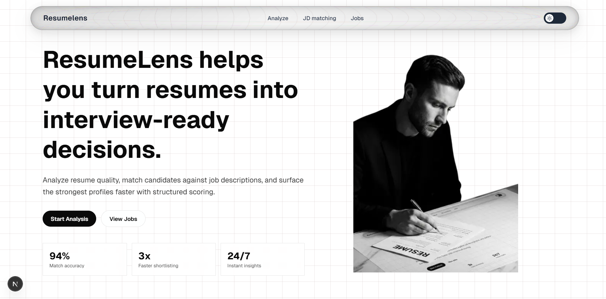

# ResumeLens

ResumeLens is a Next.js app for resume analysis and job-fit workflows. It provides:

- Resume scoring and role recommendations
- Resume vs Job Description (JD) matching
- Curated job search links based on role
- A modern landing page with light and dark UI variants

## Landing Page Preview



## Tech Stack

- Next.js 16 (App Router)
- React 19
- TypeScript
- Tailwind CSS 4

## Getting Started

Install dependencies:

```bash
npm install
```

Run the development server:

```bash
npm run dev
```

Open [http://localhost:3000](http://localhost:3000).


## Routes

- `/` - Landing page
- `/analyze` - Resume analysis and recommendation view
- `/jdmatch` - Resume vs JD match flow
- `/jobs` - Job recommendation links

## Project Structure

```text
app/
  page.tsx
  analyze/page.tsx
  jdmatch/page.tsx
  jobs/page.tsx
components/
public/
```

## Scripts

- `npm run dev` - Start local development server
- `npm run build` - Create production build
- `npm run start` - Run production server
- `npm run lint` - Run ESLint

## Notes

- Current scoring outputs in `analyze` and `jdmatch` are mock/demo data in the frontend.
- Resume uploads currently accept PDF files in the UI.
